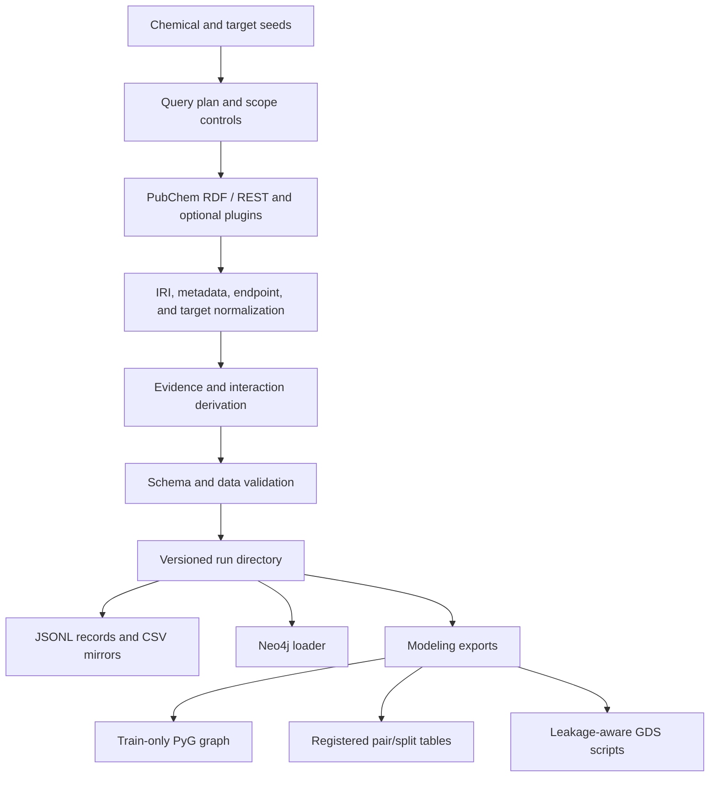

# System architecture

PRING-PACKAGE separates acquisition, normalization, graph construction,
validation, persistence, and export so each stage can be audited independently.

## Component responsibilities

| Component | Responsibility | Key invariant |
|---|---|---|
| Extractors | Retrieve source records within a declared scope | Every record retains source identity |
| Normalizers | Canonicalize identifiers and scientific metadata | Transformation rules are deterministic |
| Interaction derivation | Convert evidence into task labels | Label policy is explicit and versioned |
| Run store | Persist artifacts and manifests | Identical inputs/configuration yield stable identities |
| Validators | Check schema, identifiers, graph references, and exports | Invalid records fail before loading/modeling |
| Neo4j loader | Create constraints, nodes, and relationships | Re-loading is idempotent; parallel evidence survives |
| Modeling export | Generate pair data, mappings, tensors, and scripts | Held-out interactions are absent from training graphs |

## Repository boundary

PRING-PACKAGE produces a portable run contract. Consumers should read the run
manifest and modeling manifest instead of inferring meaning from filenames.
PRING-APP is one consumer, but the contract is designed for other domains and
applications.

## Extension points

- Add a source through the plugin interfaces while retaining source
  identifiers and checksums.
- Add node or relationship families by updating the schema, validators,
  serialization, and loader together.
- Add features only when identifier exclusion and split-aware fitting tests
  cover them.
- Add a domain configuration without embedding CYP450-specific assumptions in
  the generic run contract.

