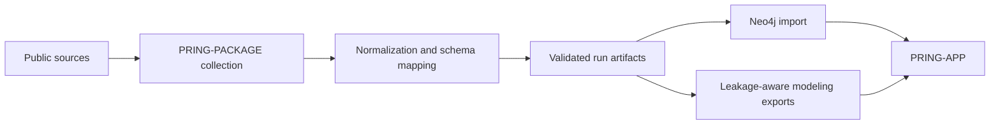

# Build evidence-aware knowledge graphs

PRING-PACKAGE collects and normalizes public chemical-biology data, constructs
schema-aligned knowledge graphs, validates their integrity, and exports
reproducible datasets for graph and tabular modeling.

[Install and run a demo](getting-started.md){ .md-button .md-button--primary }
[Explore the architecture](architecture.md){ .md-button }

## What the package provides

-   :material-database-import:{ .lg .middle } **Collection**

    ---

    Target- and compound-centered retrieval from PubChem RDF and REST sources,
    with explicit caps, throttling, retries, and cached responses.

-   :material-graph-outline:{ .lg .middle } **Knowledge-graph construction**

    ---

    Schema-aligned nodes and evidence-preserving relationships with deterministic
    identifiers, validation summaries, JSONL records, and CSV mirrors.

-   :material-shield-check:{ .lg .middle } **Scientific safeguards**

    ---

    Versioned manifests, source checksums, train-only graph exports, identifier
    exclusion, split registries, and contamination controls.

-   :material-chart-box-outline:{ .lg .middle } **Modeling-ready outputs**

    ---

    Pair tables, train-only PyTorch Geometric data, node mappings, typed edge
    indexes, candidate pairs, and Neo4j GDS preparation scripts.

## Package boundary

PRING-PACKAGE owns data acquisition, transformation, graph materialization,
quality assurance, and modeling-data export. It does **not** claim that a
generated model is clinically validated or publication-ready.

The companion [PRING-APP](https://asmaa-a-abdelwahab.github.io/PRING-APP/)
loads package runs into Neo4j and provides exploration, reporting, modeling,
and prediction interfaces.

!!! warning "Research software"
    Labels derived from bioassays, text-mining, similarity, or operational
    rules can carry uncertainty and selection bias. Validate the exact task,
    label policy, split registry, and external generalization before drawing
    scientific or clinical conclusions.

